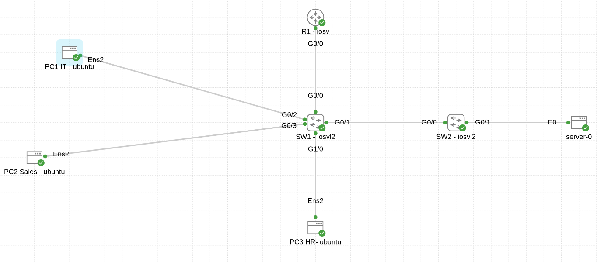
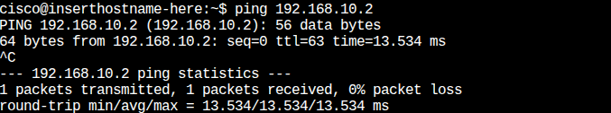
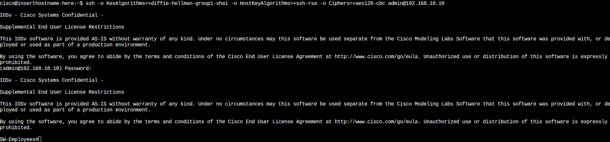

<div dir="rtl">

# 🏢 مشروع محاكاة وتصميم شبكة مؤسسية 

---

## 📝 نظرة عامة وسياق المشروع :

تم تصميم هذا المشروع لمحاكاة بنية تحتية لشبكة شركة متوسطة الحجم (50 - 100 موظف)، تهدف لربط عدة أقسام وظيفية ومركز بيانات (Server Room) مع تطبيق معايير الأمان والتوجيه.
تم تنفيذ المحاكاة باستخدام **Cisco Modeling Labs (CML)** لضمان واقعية السلوك الشبكي للأجهزة.

---

## 🧠 قرارات التصميم :

تم اختيار هذه التقنيات بناءً على دراسة التكلفة والكفاءة:

### 🔹 لماذا ROAS - Router on a Stick؟
بدلاً من استخدام Layer 3 Switch مرتفع التكلفة، اعتمدت على تقنية ROAS للاستفادة من قدرات الراوتر لتوجيه البيانات (Inter-VLAN Routing).
> *هذا الحل مثالي للشركات التي لا تتجاوز حركة البيانات فيها 1Gbps.*

### 🔹 لماذا DHCP على الراوتر (Router-Based DHCP)؟
لضمان إدارة مركزية (Centralized Management) للعناوين وتقليل الحاجة إلى أجهزة خوادم إضافية في الفروع الصغيرة والمتوسطة.

### 🔹 فصل السيرفرات في سويتش مستقل
تم وضع السيرفرات في Access Switch منفصل عن الموظفين لتحسين العزل الأمني (Physical & Logical Isolation) ولتسهيل إنشاء DMZ مستقبلاً دون التأثير على شبكة الموظفين.

---

## 🗺️ مخطط الشبكة :



يعتمد التصميم على هيكلية منظمة توضح تدفق البيانات:

* **Edge Router (R1):** يعمل كبوابة رئيسية (Gateway) لكل VLAN لإخراج البيانات إلى الإنترنت أو بين الأقسام.
* **Main Switch (SW-Employees):** يعمل كنقطة تجميع (Distribution) للموظفين، ويرتبط بالراوتر عبر رابط Trunk.
* **Extension Switch (SW-Servers):** مخصص للسيرفرات فقط لضمان العزل والأداء.

---

## 🔢 مخطط العناوين :

تم اعتماد القناع `/24` لجميع الشبكات، حيث يوفر 254 عنواناً، مما يغطي عدد الموظفين الحالي (50-100) ويسمح بالتوسع المستقبلي المريح.

| القسم (Department) | رقم VLAN | نطاق الشبكة | ملاحظات التصميم |
| :---: | :---: | :---: | :---: |
| IT Dept | 10 | 192.168.10.0/24 | شبكة الإدارة والتحكم |
| Sales | 20 | 192.168.20.0/24 | شبكة الموظفين العامة |
| HR | 30 | 192.168.30.0/24 | شبكة معزولة للخصوصية |
| Servers | 40 | 192.168.40.0/24 | VLAN معزولة كلياً لحماية البيانات |

---

## 🛠️ مقتطفات من الإعدادات :

أجزاء مختارة من الكود توضح طريقة بناء الشبكة:

### 1. إنشاء التقسيمات (VLAN ):
```cisco
vlan 10
name IT
vlan 40
name Servers
!
interface GigabitEthernet0/1
switchport mode access
switchport access vlan 40
```

### 2. توجيه البيانات ( ROAS Configuration)
```cisco
interface GigabitEthernet0/0.10
encapsulation dot1Q 10
ip address 192.168.10.1 255.255.255.0
description Gateway-IT
```

### 3. توزيع العناوين (DHCP Pool)
```cisco
ip dhcp pool SALES_POOL
network 192.168.20.0 255.255.255.0
default-router 192.168.20.1
dns-server 8.8.8.8
```

### 4. الأمان (SSH Setup)
```cisco
username admin privilege 15 secret Cisco123
crypto key generate rsa
line vty 0 4
transport input ssh
login local
```

---

## 💡 التحديات التقنية:

1. **مشكلة تشفير SSH في بيئة المحاكاة:**
- المشكلة: أجهزة Linux الحديثة رفضت الاتصال بالسويتش القديم (Legacy IOS) بسبب ضعف خوارزميات التشفير.
- الحل المؤقت (Lab):
```
ssh -o KexAlgorithms=+diffie-hellman-group1-sha1
```
- التوصية (Production): ترقية نظام تشغيل السويتش لدعم تشفير AES الحديث.

2. **السيرفر لا يستجيب (Routing Issue):**
- المشكلة: فشل الوصول للسيرفر رغم وجود IP صحيح.
- التحليل: غياب إعداد Default Gateway.
- الحل: ضبط الـ Gateway يدوياً في السيرفر.

---

## ✅ التحقق والاختبار :

### 1. اختبار الاتصال :
صورة تثبت نجاح الاتصال بين جهاز المبيعات (VLAN 20) والسيرفر (VLAN 40) عبر الراوتر.


### 2. الوصول الآمن (SSH Access)
إثبات القدرة على إدارة الشبكة عن بعد من جهاز مهندس الـ IT.


---

## 🎓 الدروس المستفادة :

- **أهمية Default Gateway للسيرفرات:** تعلمت أن امتلاك IP لا يكفي، فبدون Gateway يصبح السيرفر قادراً على الاستقبال ولكنه عاجز عن الرد على الشبكات الخارجية.
- **فهم تدفق البيانات:** اتضح عملياً كيف تنتقل البيانات وتتغير VLAN Tag أثناء مرورها عبر منافذ Trunk و Access.
- **المرونة في حل المشاكل:** التعامل مع مشكلة توافق SSH علمني كيف أبحث في توثيق الأوامر (Linux Man Pages) لإيجاد حلول بديلة.

---

(الملفات المرفقة تحتوي على الإعدادات الكاملة: R1-Config, SW-Configs)

</div>
