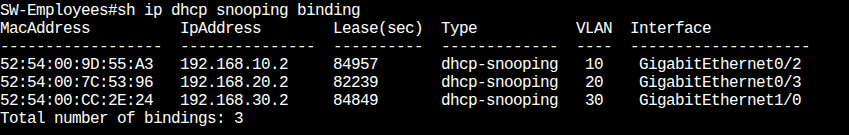
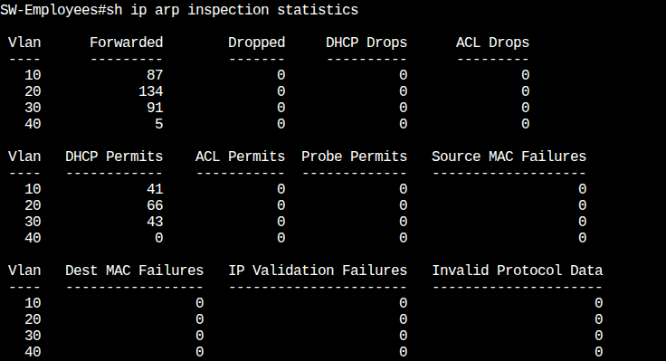
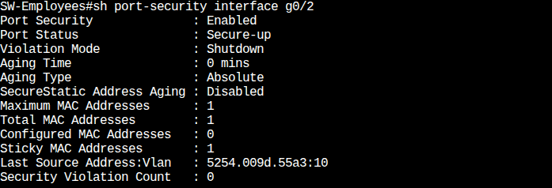
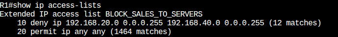
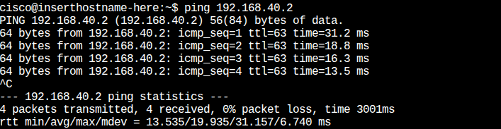
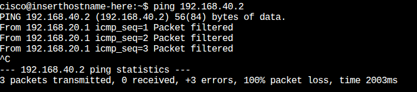

<!-- Title Section -->

    <h1>🛡️ Secure Network Infrastructure Project</h1>
    <h3>(Layer 2 & Layer 3 Hardening)</h3>

<!-- Section 1 -->
<h2 dir="ltr">1. Project Overview</h2>

تم تنفيذ هذا المشروع لتأمين بنية الشبكة المؤسسية (Enterprise LAN) ضد الهجمات الداخلية الشائعة. تُقدَّر نسبة كبيرة من التهديدات الأمنية بأنها تأتي من داخل الشبكة، سواء كانت مقصودة أو نتيجة أخطاء المستخدمين.

<strong>الهدف الرئيسي:</strong> 
تحويل الشبكة من بيئة Open Access إلى شبكة تعتمد مبدأ Zero Trust at the Access Layer باستخدام تقنيات Cisco Security.

<strong>ما الذي تمت حمايته؟</strong>

<ul>
    <li>منع توصيل أجهزة غير مصرح بها (Rogue Devices)</li>
    <li>منع هجمات انتحال العناوين (IP & ARP Spoofing)</li>
    <li>منع توزيع عناوين IP مزيفة (Rogue DHCP)</li>
    <li>عزل الأقسام الحساسة (ACL Segmentation)</li>
    <li>حماية الشبكة من الإغراق (Storm Control)</li>
</ul>

<!-- Section 2 -->
<h2 dir="ltr">2. Network Topology</h2>

    

<!-- Section 3 -->
<h2 dir="ltr">3. VLAN & IP Addressing Table</h2>
<table border="1" width="100%" cellspacing="0" cellpadding="5">
    <thead>
        <tr style="background-color: #f6f8fa;">
            <th align="center">VLAN</th>
            <th align="center">الاسم</th>
            <th align="center">الشبكة</th>
            <th align="center">الغرض</th>
            <th align="center">الأجهزة</th>
        </tr>
    </thead>
    <tbody>
        <tr>
            <td align="center">10</td>
            <td align="center">IT</td>
            <td align="center" dir="ltr">192.168.10.0/24</td>
            <td align="right">الإدارة والدعم الفني</td>
            <td align="center">PC1</td>
        </tr>
        <tr>
            <td align="center">20</td>
            <td align="center">Sales</td>
            <td align="center" dir="ltr">192.168.20.0/24</td>
            <td align="right">قسم المبيعات (وصول محدود)</td>
            <td align="center">PC2</td>
        </tr>
        <tr>
            <td align="center">30</td>
            <td align="center">HR</td>
            <td align="center" dir="ltr">192.168.30.0/24</td>
            <td align="right">الموارد البشرية</td>
            <td align="center">PC3</td>
        </tr>
        <tr>
            <td align="center">40</td>
            <td align="center">Servers</td>
            <td align="center" dir="ltr">192.168.40.0/24</td>
            <td align="right">مركز البيانات والخدمات</td>
            <td align="center">Main Server</td>
        </tr>
        <tr>
            <td align="center">99</td>
            <td align="center">Native</td>
            <td align="center">N/A</td>
            <td align="right">VLAN مخصّصة للإدارة (Best Practice)</td>
            <td align="center">Unused Ports</td>
        </tr>
    </tbody>
</table>

<!-- Section 4 -->
<h2 dir="ltr">4. Devices Used</h2>

تم تنفيذ المشروع باستخدام Cisco Modeling Labs (CML):

<ul>
    <li dir="ltr" align="right">Router (R1): Cisco IOSv (Gateway & DHCP Server)</li>
    <li dir="ltr" align="right">2x Switches: (SW-Employees, SW-Servers) — Cisco IOSvL2</li>
    <li dir="ltr" align="right">3x End Devices: Ubuntu Linux Nodes</li>
    <li dir="ltr" align="right">1x Server: Generic Server Node</li>
</ul>

<!-- Section 5 -->
<h2 dir="ltr">5. Security Features Implemented</h2>
<ul>
    <li>✅ <strong>Port Security:</strong> تقييد الوصول الفيزيائي</li>
    <li>✅ <strong>BPDU Guard:</strong> منع الـ Layer 2 loops</li>
    <li>✅ <strong>DHCP Snooping:</strong> منع Rogue DHCP</li>
    <li>✅ <strong>Dynamic ARP Inspection (DAI):</strong> حماية من ARP Poisoning</li>
    <li>✅ <strong>Access Control Lists (ACLs):</strong> التحكم في حركة المرور</li>
    <li>✅ <strong>Trunk Hardening:</strong> السماح فقط بالـ VLANs الضرورية</li>
    <li>✅ <strong>Logging & Monitoring:</strong> تسجيل الأحداث الأمنية</li>
</ul>

<!-- Section 6 -->
<h2 dir="ltr">6. Security Feature Explanation</h2>

<h3>🔒 1. Port Security</h3>

<strong>الهدف:</strong> السماح فقط للجهاز المصرح له (MAC Address) بالاتصال بالمنفذ. 
<strong>السلوك:</strong> عند تغيير الجهاز يتم إيقاف المنفذ تلقائيًا.

<strong>التطبيق:</strong> 
Maximum = 1 مع وضع المخالفة Shutdown.

<strong>قبل:</strong> أي شخص يستطيع فصل الكابل وتوصيل جهازه. 
<strong>بعد:</strong> يتوقف المنفذ مباشرة عند محاولة تغيير الجهاز.

<strong>الكود:</strong>

<pre><code>switchport port-security
switchport port-security maximum 1
switchport port-security mac-address sticky
switchport port-security violation shutdown</code></pre>

 

<h3>🛡️ 2. DHCP Snooping</h3>

<strong>الهدف:</strong> منع أي جهاز غير الراوتر الرسمي من توزيع عناوين IP. 
<strong>التطبيق:</strong> المنافذ الخاصة بالموظفين Untrusted، منفذ الراوتر والترانك Trusted.

<strong>الكود:</strong>

<pre><code>ip dhcp snooping
ip dhcp snooping vlan 10,20,30,40
no ip dhcp snooping information option

interface g0/0
ip dhcp snooping trust</code></pre>

 

<h3>🕵️‍♂️ 3. Dynamic ARP Inspection (DAI)</h3>

<strong>الهدف:</strong> حماية الشبكة من ARP Poisoning وانتحال العناوين. 
<strong>التطبيق:</strong> مقارنة كل ARP Packet مع DHCP Binding

<strong>الكود:</strong>

<pre><code>ip arp inspection vlan 10,20,30,40

interface g0/0
ip arp inspection trust</code></pre>

 

<h3>⛔ 4. Access Control Lists (ACLs)</h3>

<strong>الهدف:</strong> تطبيق مبدأ Least Privilege بين الأقسام. 
<strong>مثال:</strong> منع Sales (VLAN 20) من الوصول لسيرفرات VLAN 40.

<strong>الكود (على R1):</strong>

<pre><code>ip access-list extended BLOCK_SALES_TO_SERVERS
deny ip 192.168.20.0 0.0.0.255 192.168.40.0 0.0.0.255
permit ip any any

interface g0/0.20
ip access-group BLOCK_SALES_TO_SERVERS in</code></pre>

<!-- Section 7 -->
<h2 dir="ltr">7. Challenges & Troubleshooting</h2>

<h3 dir="ltr">A. مشاكل الأجهزة (The 3-PC Scenario)</h3>

<h4>1. PC1 (IT)</h4>
<ul>
    <li><strong>الرسالة:</strong> Destination Host Unreachable</li>
    <li><strong>التحليل:</strong> الجهاز يستخدم Static IP غير مسجل في DHCP Snooping.</li>
    <li><strong>السبب:</strong> تم اعتباره spoofing من DAI.</li>
    <li><strong>الحل:</strong> إعادة الجهاز إلى DHCP.</li>
</ul>

<h4>2. PC3 (HR)</h4>
<ul>
    <li><strong>الرسالة:</strong> Network is unreachable</li>
    <li><strong>التحليل:</strong> الجهاز فقد عنوان IP بعد تفعيل الحماية.</li>
    <li><strong>السبب:</strong> DHCP lease expired.</li>
    <li><strong>الحل:</strong> إعادة تشغيل كرت الشبكة لإعادة طلب IP.</li>
</ul>

<h4>3. PC2 (Sales)</h4>
<ul>
    <li><strong>اتصال ناجح</strong></li>
    <li>كان الدليل على سلامة إعدادات الراوتر والترانك، وأن المشاكل في الجهازين الآخرين فقط.</li>
</ul>

<h3 dir="ltr">B. مشاكل البنية التحتية</h3>

<h4>المشكلة 4: DAI Flooding</h4>
<ul>
    <li>السويتش بدأ بحجب ردود الراوتر وإرسال <code>DHCP_SNOOPING_DENY</code>.</li>
    <li><strong>الحل:</strong> جعل منفذ الراوتر Trusted.</li>
</ul>

<h4>المشكلة 5: انقطاع الوصول للسيرفر</h4>
<ul>
    <li><strong>السبب:</strong> منفذ الترانك لم يكن Trusted.</li>
    <li><strong>الحل:</strong> تفعيل trust على منفذ g0/1:</li>
</ul>

<pre><code>ip dhcp snooping trust
ip arp inspection trust</code></pre>

<!-- Section 8 -->
<h2 dir="ltr">8. Verification & Screenshots</h2>

<strong>1. DHCP Snooping Binding:</strong>

    

<strong>2. DAI Stats</strong>

    

<strong>3. Port Security</strong>

    

<strong>4. ACL Matches</strong>

    

<strong>5. Before/After Ping Tests:</strong>

PC1 Ping Success:

    

PC2 Blocked by ACL:

    

<!-- Section 9 -->
<h2 dir="ltr">9. Configuration Files</h2>

تم إرفاق ملفات الإعدادات النهائية:

<ul>
    <li dir="ltr" align="left">📄 SW1-Hardened-Config.txt</li>
    <li dir="ltr" align="left">📄 R1-Config.txt</li>
    <li dir="ltr" align="left">📄 SW2-Server-Config.txt</li>
</ul>

<!-- Section 10 -->
<h2 dir="ltr">10. Summary & Conclusion</h2>

تم تحويل الشبكة من بيئة غير آمنة إلى بيئة محمية بالكامل:

<ul>
    <li><strong>داخلياً:</strong> لا يمكن لأي جهاز انتحال عنوان أو تمرير حركة غير شرعية.</li>
    <li><strong>فيزيائياً:</strong> لا يمكن توصيل أجهزة مجهولة.</li>
    <li><strong>تنظيمياً:</strong> تم تطبيق سياسات العزل بنجاح.</li>
</ul>

<strong>النتيجة:</strong> 
شبكة يصعب استغلالها، وتطبق مبدأ التحكم الدقيق في الوصول.

<!-- Section 11 -->
<h2 dir="ltr">11. Future Enhancements</h2>
<ul>
    <li dir="ltr" align="right">تطبيق 802.1X Authentication</li>
    <li dir="ltr" align="right">إعداد Syslog Server مركزي</li>
    <li dir="ltr" align="right">تفعيل SNMPv3 للأمان والمراقبة</li>
</ul>

